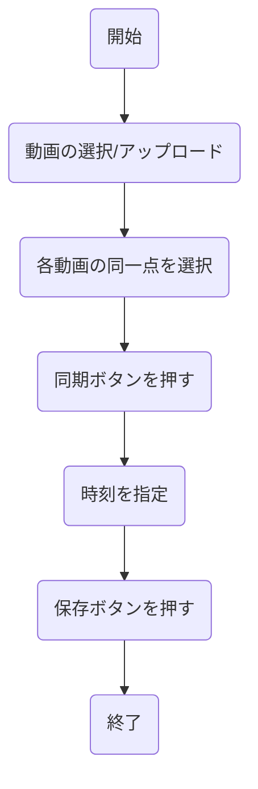

# 外部設計

## ユーザーストーリー
同じ場面を撮影した動画群に対して、同一点を指定し、同一時刻のフレームを保存したい

## ユーザーフロー図

```mermaid
flowchart TD
    A(開始) --> B(動画の選択/アップロード)
    B --> C(各動画の同一点を選択)
    C --> D(同期ボタンを押す)
    D --> E(時刻を指定)
    E --> F(保存ボタンを押す)
    F --> G(終了)  
```
